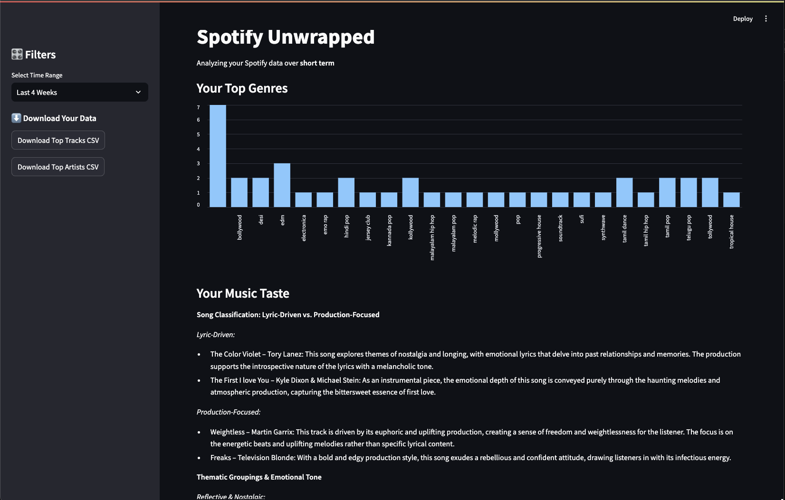
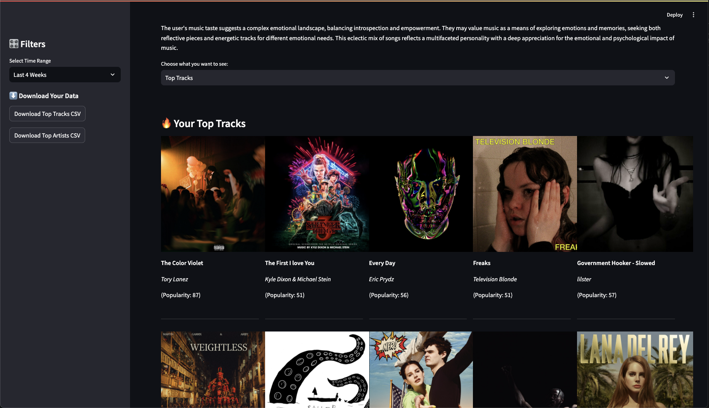
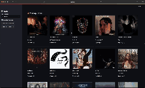
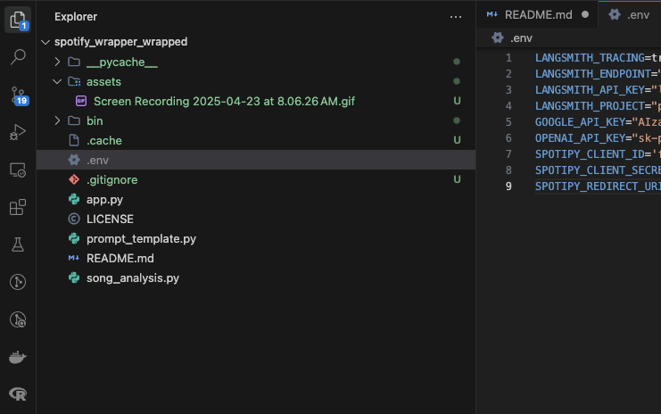

# Spotify Wrapped Unwrapped

*A personalized music analyzer and visualization app powered by **Spotify** + **OpenAI**.*  
Get deep, AI‑generated insights into your top tracks and artists—exploring lyrical, emotional, and psychological dimensions of your listening habits.

<table>
  <tr>
    <td></td>
  </tr>
  <tr>
    <td></td>
  </tr>
</table>

*Your music identity, visualized and analyzed in real‑time!*

## Features

| Category | What you get |
|----------|--------------|
| **Spotify OAuth Integration** | Securely log in and fetch your top tracks & artists across short‑, medium‑ and long‑term time ranges. |
| **Genre & Popularity Analysis** | Interactive bar charts that reveal your most‑played genres, artist popularity trends, and listening windows. |
| **AI‑Powered Music‑Taste Analysis** | • Classifies songs as **lyric‑driven** vs. **production‑focused**.<br>• Groups tracks by emotional / thematic categories.<br>• Infers psychological & personality traits from your listening profile using GPT via LangChain. |
| **Modern, Responsive UI** | 🎛️ Filter by time range · Album‑art grid views · 📥 One‑click CSV export. |

## Demo



*Blitzing through your top tracks and artists in real-time.*


## Usage Walk‑through

### 1 · Clone the repo
```bash
git clone https://github.com/yourusername/spotify‑unwrapped.git
cd spotify‑unwrapped
```

### 2 · Install dependencies
```bash
pip install -r requirements.txt
```

### 3 · Set up Spotify + OpenAI credentials
Create a `.env` file in the project root:



```env
SPOTIPY_CLIENT_ID=your_client_id
SPOTIPY_CLIENT_SECRET=your_client_secret
SPOTIPY_REDIRECT_URI=http://localhost:8501
OPENAI_API_KEY=your_openai_api_key
```
*Register an app on the [Spotify Developer Dashboard](https://developer.spotify.com/dashboard/) to obtain your client credentials.*

### 4 · Run the app
```bash
streamlit run app.py
```

## How It Works

1. **Select Time Range** – choose *4 weeks*, *6 months*, or *all time*.
2. **Explore Insights**  
   • View top genres (bar chart)   
   • Inspect top tracks & artists (album‑art grid)   
   • Read a deep‑dive **AI report** covering lyrical themes, emotional tone & psychological insights.
3. **Download Data** – Export your top tracks and artists as CSV for further exploration.


## How It Actually Works

1. **Data Collection** – Spotipy pulls your personal data via the Spotify Web API, by sinning a spotipy server locally for authenticating the user.
2. **Data Processing** – `pandas` & `collections.Counter` aggregate genres and popularity metrics.
3. **AI Analysis** – Top tracks + Artists are piped through **LangChain** to GPT using a curated prompt (`prompt_template.py`). The model returns a structured, sectioned report.
4. **Visualization** – Streamlit renders interactive charts, metrics, and grids for a frictionless user experience.

## Tech Stack

- **Streamlit** – real‑time web UI  
- **Spotipy** – Spotify Web API client  
- **LangChain** + **OpenAI GPT** – LLM orchestration & analysis  
- **Pandas**, **Python 3.10+**, **dotenv**  

## Project Structure
```text
.
├── app.py
├── song_analysis.py
├── prompt_template.py 
├── requirements.txt
├── LICENSE
└── README.md (you are here)
```

## Example Output
```
Song Classification: Lyric‑Driven vs. Production‑Focused
• “Cinnamon Girl” – Lana Del Rey → lyric‑driven: heartbreak, vulnerability...
Psychological Insight
You may be introspective, emotionally deep, and find comfort in melancholic beauty...
```

## License

This project is licensed under the **MIT License** – see [LICENSE](./LICENSE) for details.
Created by **Inturi, Nikhil Nageshwar**  
